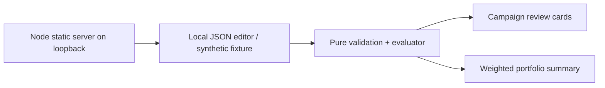

# Campaign Studio

An independent portfolio project exploring an AI marketing-agent dashboard for small businesses. Repository: `lemonlime-ai-marketing-agent`. The working MVP evaluates campaign performance with transparent, deterministic rules; a real model integration is future work.

**Original work. Not affiliated with, sponsored by, or endorsed by LemonLime. No proprietary code, assets, or branding.**

## Problem
Small business owners can see clicks and spend but struggle to decide what to investigate next. Campaign Studio combines basic economics with readable recommendations, so an owner can review weak creative, tracking problems, and promising experiments in one place.

## Run locally
Requires Node.js 22 or later. No package installation, API key, or paid service is needed.

```sh
npm start
# Open http://127.0.0.1:3000
npm test
```

Optional configuration: copy `env.example` to `.env`, then run `node --env-file=.env server.mjs`. `PORT` defaults to 3000. `npm start` uses existing process environment and does not automatically load `.env`.

## Working MVP
- Responsive dashboard with spend, attributed revenue, blended ROAS, and conversion totals.
- Editable synthetic JSON; validation rejects inconsistent counts, duplicate IDs, and invalid numbers.
- CTR, conversion rate, CPA, and ROAS with explicit unknown values for zero denominators.
- Per-campaign recommendations with sample-size checks and visible reasoning.
- Local tab-only processing: no persistence, analytics, model calls, messages, or budget changes.
- Resettable fixtures, accessible labels, keyboard focus, and announced validation feedback.

The default dataset is synthetic. Use campaigns from **one reporting period and currency (USD)**. Counts assume a simple click-through funnel: conversions ≤ clicks ≤ impressions. View-through and multi-conversion attribution are intentionally unsupported. The demo considers 1,000 impressions and 30 clicks sufficient to show its illustrative rules; these are not statistical confidence bounds. The 1% CTR and 2× ROAS targets are examples, not industry benchmarks or profitability guarantees.

## Architecture and stack


Modern browser ES modules, semantic HTML, CSS, and Node's built-in HTTP server and test runner. Zero runtime or development dependencies. The server exposes an explicit public-asset allowlist, never repository files. User-supplied strings enter the DOM using `textContent`.

| File | Responsibility |
| --- | --- |
| `public/evaluator.js` | Pure input validation, metrics, rules, totals |
| `public/app.js` | Editor interactions and safe dashboard rendering |
| `public/demo.json` | Synthetic demonstration campaigns |
| `server.mjs` | Local asset server; no API or data storage |
| `test/evaluator.test.js` | Metrics, invalid inputs, zero denominators, sample thresholds |

## AI extension boundary
A future server-side provider adapter may turn the validated metrics into an additional explanation. It must preserve numeric facts, expose provenance, treat campaign text as untrusted input, and keep keys server-side. Any real campaign change requires an explicit human review step. The present version does not call an LLM and should not be represented as a production autonomous agent.

## Tests and roadmap
`npm test` runs unit tests for financial ratios, weighted totals, malformed inputs, overflow, low samples, and campaign outcomes. GitHub Actions runs the same suite on pushes and pull requests. See [ROADMAP.md](ROADMAP.md) for issue-ready milestones and [design notes](docs/design.md) for decisions and acceptance criteria.

## License
MIT for original code; see [LICENSE](LICENSE). Names of other companies remain their owners' property. MIT makes this small portfolio implementation straightforward to study and reuse.
